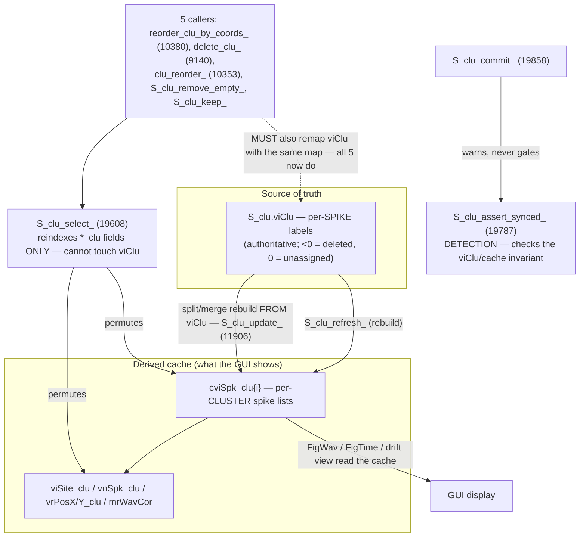

# Plan — cluster-identity hardening (detection + abort-handling)

**Date:** 2026-07-16 · **Branch:** `rewind` · **Author:** re-evaluation pass
**Depends on:** the fixes in `87cd4f1` and `d954926` (`delete_clu_`/`merge_clu_`/`post_merge_wav_`/parpool — all committed).
**Tracker:** [`logs/ISSUE_TRACKER_cluster_identity.md`](ISSUE_TRACKER_cluster_identity.md)

---

## ✅ STATUS — P1, P2, P3a, P3b, X3 all DONE & verified

**Completed (2026-07-16 implementation session):**
- ✅ **P1** (load-time detection in `load0_`) — `verify_p1_p3a.m` 4/4.
- ✅ **P3a** (sync check on the `[O]` path in `reorder_clu_by_coords_`) — `verify_p1_p3a.m` 4/4.
- ✅ **P2-core + P2a–d** (explicit `fOk`, all four call-site groups) — `verify_p2.m` 4/4.
- ✅ **P3b** (`cviSpk_clu` critical field) — `verify_p3b.m` 3/3.
- ✅ **X3** (hard-fail `split_clu_` truncate/pad) — trace + `checkcode` (GUI-blocking, not headless).
- ⏳ **X1, X2, X4** — deferred (independent; X4 is a `.prb` data fix, CID-14).

**Decisions (§9, user 2026-07-16):** explicit `fOk`; all four groups; implement P3b; hard-fail X3.

Docs updated: `logs/changes_log20260716.md` (full record), `logs/ISSUE_TRACKER_cluster_identity.md`
(CID‑06 coverage, CID‑07…10 marked committed in `d954926`, CID‑11 → fixed via P3b, timeline,
assets). Verification fixtures in scratchpad: `verify_p1_p3a.m`, `verify_p2.m`, `verify_p3b.m`.

**Historical resume notes (for reference; work is done):**
1. Read §7 (ordering) and §9 (open decisions) first — §9 has **two decisions that must be
   confirmed with the user before any code is written**: (a) P2 mechanism — explicit `fOk` output
   vs `nClu`-delta; (b) P3b — accept the crash-vs-silent-corruption trade. Do **not** assume
   either; ask.
2. Suggested first step (lowest risk): **P1** (load-time detection in `load0_`) + **P3a** (one-line
   detector on the `[O]` path in `reorder_clu_by_coords_`). Both are additive, warn-only.
3. **P2** is the only medium-risk change (edits the primary `[U]` handler,
   `execute_pending_and_update_`); ship it only behind the negative control described in §3.
4. **Line numbers are current as of `d954926`** (refreshed 2026-07-16) but will drift with any
   further edit to `irc.m` — they are big single-file offsets, so re-`grep` each function name to
   confirm before editing rather than trusting the number.
5. **Verification fixtures were in this session's scratchpad and are NOT committed** — they must be
   re-created. The key one: a 5-cluster synthetic `S_clu` whose `cviSpk_clu` is deliberately one
   entry short of `nClu`, which forces `struct_select_` to throw inside `struct_select_safe_` and
   makes `delete_clu_` abort — that is the negative control every P2 change is gated on. (This
   session's versions: `verify_delete_clu.m`, `verify_merge_clu_real.m`, `verify_post_merge_wav.m`.)
6. Every code change ships with a negative control that **fails without the change**, per the
   standard this investigation established. No functions deleted; additive/fix-only per `CLAUDE.md`.

**Do not re-litigate the diagnosis** — it is settled (`0/547` stale on the fresh sort; all 5
`S_clu_select_` callers verified to remap `viClu`). This plan is hardening, not root-cause work.

---

## 0. Why this plan exists

An independent re-evaluation (exhaustive `S_clu_select_` caller sweep + adversarial review of the
applied fixes) reached three conclusions:

1. **The desync *class* is closed.** All **5** callers of `S_clu_select_` now remap `viClu`
   correctly (`S_clu_remove_empty_`, `S_clu_keep_`, `delete_clu_`, `clu_reorder_`,
   `reorder_clu_by_coords_`). The sort path is clean (`0/547` stale). No latent caller of this
   class remains, so **no centralized refactor is warranted** — it would touch every caller for
   zero coverage gain.
2. **Detection is incomplete.** The sync check runs only at the `S_clu_commit_` choke point, so
   (a) a corrupted file opens **silently** (`load0_` validates nothing) and (b) the `[O]` path
   bypasses the choke point entirely.
3. **Abort-handling is incomplete.** `delete_clu_`/`merge_clu_` now roll back rather than create a
   desync — but their callers don't *check* the abort, so on an abort they still shift the
   pending-operation queue and write a phantom log entry. The primary `[U]` merge path
   (`execute_pending_and_update_`) doesn't even go through `merge_clu_`.

This plan addresses 2 and 3. It does **not** re-open the diagnosis (settled) or add more rollback
to `S_clu_select_` (unnecessary).

### Reachability note (honest severity)

The abort path (P2) only fires when `cviSpk_clu` is **length-malformed** on input — the only thing
that makes `struct_select_` throw or the content-check fail. Healthy files and the user's
**permutation-desynced** files (length-consistent) do **not** trigger it. So P2 is a real
incompleteness on the primary curation path, but **Medium** severity, not Critical — and no code
change here alters spike data; the gaps are in *detection surfacing* and *log/queue bookkeeping*.

---

## 1. Change inventory

| ID | Change | File · function (line*) | Priority | Additive? | Risk |
|---|---|---|---|---|---|
| **P1** | Validate `S_clu` on load; warn if desynced | `irc.m` · `load0_` (13153) | **P1** | yes | very low |
| **P2-core** | Add `fOk` success output | `irc.m` · `delete_clu_` (9140), `merge_clu_` (9344) | **P2** | yes (opt-in output) | low |
| **P2a** | Abort-check the delete loop | `irc.m` · `execute_pending_and_update_` (9602–9611) | **P2** | yes | medium |
| **P2b** | Whole-group rollback on merge abort | `irc.m` · `execute_pending_and_update_` (9632–9651) | **P2** | yes | medium |
| **P2c** | Abort-check the immediate merge | `irc.m` · `ui_merge_` (9316) | **P2** | yes | low |
| **P2d** | Abort-check immediate + auto delete | `irc.m` · `ui_delete_` (9108), `delete_auto_` (19488) | **P2** | yes | low |
| **P3a** | Run the sync check on the `[O]` path | `irc.m` · `reorder_clu_by_coords_` (10420) | **P3** | yes | very low |
| **P3b** | Make `cviSpk_clu` a *critical* field that must not be silently skipped | `irc.m` · `struct_select_safe_` (19589) + `S_clu_select_` (19636) | **P3** | yes (opt-in arg) | see §5 |
| **X1** | Stop persisting `viClu_prematch` (~68 MB dead weight) | `irc.m` · save path | opt | yes | low |
| **X2** | Route PSTH split through `split_clu_by_id_` | `irc.m` · `cbf_split_psth_` | opt | yes | low |
| **X3** | Make `split_clu_`'s positional truncate/pad hard-fail | `irc.m` · `split_clu_` (10656–10676) | opt | no (behavior) | low |
| **X4** | Declare 4 shanks on the Neuropixels 2.0 probe | `IRC_all.prb` / `IRC.prb` (**not** `irc.m`) | opt | data | low |

*Line numbers are current-tree and drift as edits land; **anchor on function names**.

---

## 2. P1 — load-time detection *(do first: cheap, safe, immediately useful)*

**Problem.** `load0_` (irc.m:13153) does a bare `load` + `set(0,'UserData',S0)` with **no
validation**. Every pre-fix corrupted `_jrc.mat` (including the user's) opens silently; the desync
is only surfaced when the user next *commits* an operation.

**Change.** After the load succeeds and `UserData` is set, run the (cheap, warn-only) sync check.
`S_clu_assert_synced_` already reads `get0_('P')` for its `fCheck_clu_sync` gate and handles
missing fields, so it is safe to call on any load.

```matlab
% load0_, after line 13174 (if isfield(S0,'S0'), S0 = rmfield(S0,'S0'); end):
if isstruct(S0) && isfield(S0, 'S_clu') && ~isempty(S0.S_clu)
    if S_clu_assert_synced_(S0.S_clu, ['load: ' vcFile_mat]) > 0
        fprintf(2, ['\tThis file was saved with a viClu/cviSpk_clu desync. Curating it may ' ...
            'compound the damage; re-sorting is the clean recovery. ' ...
            'See logs/ISSUE_TRACKER_cluster_identity.md (CID-12).\n']);
    end
end
```

**Rationale.** `S_clu_assert_synced_` is O(nSpk) and warn-only. On a fresh sort it prints nothing
(`0` stale). On a corrupted file it names the affected clusters at open time — closing the gap
that `load0_` never refreshes and a disk desync survives reload.

**Risk.** Very low. Additive, gated by `fCheck_clu_sync` (default 1), never throws (wrapped).
Only new behavior: a warning when opening an already-corrupted file — which is the goal.

**Verify.** Load the known-good fresh sort (`_irc_all_jrc.mat`) → **0 stale, no warning**. Load a
known-corrupted file (`_IRC_jrc.mat`) → warning naming the stale clusters. (Both read-only.)

---

## 3. P2 — propagate the abort signal to the callers

**Problem.** `delete_clu_` and `merge_clu_` roll back on failure (returning an *unchanged*
`S_clu`), but their callers don't detect it. On an abort the caller still: decrements the
pending-queue indices as if a cluster were removed, and appends a `save_log_` entry for an
operation that didn't happen. The data stays consistent (rollback did its job); the **log and
pending-queue bookkeeping** desync from reality. (`delete_auto_` additionally pops a *"Deleted N
clusters"* msgbox that would be a lie on abort.)

**Design decision (refined) — return an explicit `fOk` flag, not an `nClu` delta.** The first
draft had each of 5 call sites re-derive `S_clu.nClu == nClu_before`. That is error-prone (one
forgotten site silently regresses) and non-obvious. Cleaner: `delete_clu_`/`merge_clu_` already
*know* when they abort, so have them say so.

- `delete_clu_`: `function [S_clu, fOk] = delete_clu_(...)` — set `fOk = false` at each of its two
  rollback `return`s, `fOk = true` at the normal end.
- `merge_clu_`: `function [S_clu, fOk] = merge_clu_(...)` — `fOk = false` on its rollback branch
  (the `if S_clu.nClu == nClu_pre_delete` at irc.m:9365), `true` otherwise.

This is **fully backward-compatible**: existing `S0.S_clu = delete_clu_(...)` callers request one
output and are unaffected (MATLAB allows requesting fewer outputs). It adds no logic to the
verified `S_clu` transforms — only sets a flag at the *existing* return points — so the current
negative controls (`verify_delete_clu.m` 7/7, `verify_merge_clu_real.m` 5/5) still hold; re-run
them to confirm. The `nClu`-delta form is retained only as the zero-core-change fallback if
re-touching the core functions is undesirable.

**All delete/merge call sites (from the sweep):** `ui_delete_` (9108), `merge_clu_`'s internal
delete (9361 — already inside `merge_clu_`'s own rollback, no caller change), `execute_pending_and_update_`
(9607, 9638), `delete_auto_` (19488), `ui_merge_`→`merge_clu_` (9316).

### P2a — `execute_pending_and_update_` delete loop (9602–9611)

Move the `csLog` append to **after** a success check; skip the index shift on abort. (`csLog` is
currently appended at 9605 *before* the delete — that is the phantom-log source.)

```matlab
for iDel = 1:numel(viDelete)
    iClu = viDelete(iDel);
    [S0.S_clu, fOk] = delete_clu_(S0.S_clu, iClu);
    if ~fOk                                              % aborted (see its own warning)
        fprintf(2, 'execute_pending_: delete of Clu %d aborted; skipping its log + index shift.\n', iClu);
        continue;
    end
    fprintf('  Deleting Clu %d\n', iClu);
    csLog{end+1} = sprintf('delete %d', iClu);           % log only on success
    S0.cviMerge_pending = adjust_pending_indices_(S0.cviMerge_pending, iClu);
end
```

### P2b — `execute_pending_and_update_` merge loop (9632–9649): roll back the WHOLE group

`merge_clu_pair_` mutates before `delete_clu_`, so a mid-group abort would leave the group
*partially* merged. A group merge is one user action, so make it atomic: snapshot **before the
group loop**, and on any sub-merge abort restore the group and log nothing for it.

```matlab
S_clu_group_snap = S0.S_clu;                             % snapshot the whole group
csLog_group = {};                                        % stage this group's log entries
fGroupOk = true;
for j = numel(viClu_group):-1:2
    iClu_source = viClu_group(j);
    S0.S_clu = merge_clu_pair_(S0.S_clu, iClu_target, iClu_source);
    [S0.S_clu, fOk] = delete_clu_(S0.S_clu, iClu_source);
    if ~fOk
        S0.S_clu = S_clu_group_snap;                     % undo the entire group
        fprintf(2, 'execute_pending_: merge group -> Clu %d aborted at source %d; rolled back, not logged.\n', ...
            iClu_target, iClu_source);
        fGroupOk = false; break;
    end
    csLog_group{end+1} = sprintf('merge %d %d', iClu_target, iClu_source);
    for k = 1:numel(viClu_group)
        if viClu_group(k) > iClu_source, viClu_group(k) = viClu_group(k) - 1; end
    end
    if iClu_target > iClu_source, iClu_target = iClu_target - 1; end
end
if fGroupOk
    csLog = [csLog, csLog_group];                        % commit the group's log only on full success
    viClu_affected = [viClu_affected, iClu_target];
end
```

*Note:* the pre-loop `csLog{end+1} = sprintf('merge ...')` currently at 9634 and the
`viClu_affected` append at 9651 both move inside the `fGroupOk` commit above.

### P2c — `ui_merge_` (9316) — early-return before the bookkeeping

The abort must return **before** the overlay/index bookkeeping at 9317-9334 and must close the
wait cursor opened at 9313:

```matlab
[S0.S_clu, fOk] = merge_clu_(S0.S_clu, S0.iCluCopy, S0.iCluPaste, P);
if ~fOk
    fprintf(2, 'ui_merge_: merge aborted (see above); no change made.\n');
    figure_wait_(0, hFig_wait);
    set(0, 'UserData', S0);   % iCluPaste still valid; leave overlays as-is
    return;
end
% ... existing 9317-9335 (iCluCopy update, overlays, adjust_pending_indices_, save_log_) unchanged ...
```

### P2d — `ui_delete_` (9108) and `delete_auto_` (19488)

**`ui_delete_`:** early-return on abort before the redraws/log (skip 9109-9121), closing
`hFig_wait`:

```matlab
[S0.S_clu, fOk] = delete_clu_(S0.S_clu, S0.iCluCopy);
if ~fOk
    fprintf(2, 'ui_delete_: delete of Clu %d aborted; no change.\n', iClu_del);
    figure_wait_(0, hFig_wait);
    return;
end
% ... existing 9109-9121 unchanged ...
```

**`delete_auto_`:** it deletes a **vector** `viClu_delete` atomically, so abort ⟺ `~fOk`.
Condition the msgbox (19493) and log (19494) on it, and report the *actual* count removed:

```matlab
[S_clu, fOk] = delete_clu_(S_clu, viClu_delete);
set0_(S_clu); S0 = gui_update_(); figure_wait_(0, hFig_wait);
if ~fOk
    msgbox_('Auto-delete aborted (cluster cache inconsistent); no clusters removed.', 1);
    return;
end
msgbox_(sprintf('Deleted %d clusters <%0.1f SNR or <%d spikes/unit.', numel(viClu_delete), snr_min_thresh, count_thresh));
save_log_(sprintf('delete-auto <%0.1f SNR or <%d spikes/unit', snr_min_thresh, count_thresh), S0);
```

**Risk (P2 overall).** Medium — it edits the primary `[U]` curation handler. But every abort
branch is gated by `~fOk`, and `fOk` is `false` only on an already-malformed input, so on
healthy/permutation-desynced state the behavior is **byte-identical** to today (the branch is
never taken). That property is what the negative control must prove.

**Verify (negative control).** Reuse the length-malformed `verify_delete_clu.m` fixture (which
forces `delete_clu_` to abort). Then:
- **Healthy input:** run a `[U]`-style delete + group-merge → indices shift, log written, `S_clu`
  and log identical to the pre-change code (guard never taken). This is the regression gate.
- **Forced abort:** assert the pending queue is **unchanged**, **no** phantom `delete`/`merge` log
  entry is appended, the `delete_auto_` msgbox reports the abort, and `S_clu` is byte-identical to
  before the aborted op (whole-group rollback for P2b).

---

## 4. P3a — run the sync check on the `[O]` path

**Problem.** `reorder_clu_by_coords_` calls `set0_` + `save0_()` directly (irc.m:10420–10422),
bypassing `S_clu_commit_`, so `S_clu_assert_synced_` never runs on `[O]` — the one path the
original bug lived on.

**Change.** One line before `save0_()`:

```matlab
set0_(S_clu);
S_clu_assert_synced_(S_clu, 'reorder_clu_by_coords_');   % detector was blind on the [O] path
S0 = gui_update_();
save0_();
```

**Risk.** Very low (warn-only). **Verify:** press `[O]` on a healthy sort → 0 stale, no warning;
on a (synthetic) desynced state → warns.

---

## 5. P3b — make `cviSpk_clu` a critical field *(optional; behavior-changing — decide first)*

**Problem (CID-11, the enabler).** `struct_select_safe_` (irc.m:19589) skips any field it can't
resize **and returns normally**; the reconcile block (19690) then pads `cviSpk_clu` with `{[]}` to
the right length. Net: content stale, length correct, no exception. This is what converts a loud
crash into silent corruption.

**Change.** Add an optional critical-field list; a critical field that throws **re-throws** instead
of being skipped. `struct_select_safe_` is called **only** by `S_clu_select_` (19630/19633/19636),
so this is fully localized.

```matlab
function S = struct_select_safe_(S, csNames, viKeep, iDimm, csCritical)
if nargin<4, iDimm = 1; end
if nargin<5, csCritical = {}; end
if ischar(csNames), csNames = {csNames}; end
for i = 1:numel(csNames)
    try
        S = struct_select_(S, csNames(i), viKeep, iDimm);
    catch ME
        if any(strcmp(csNames{i}, csCritical))
            rethrow(ME);   % identity-bearing: fail loudly rather than silently desync
        end
        fprintf(2, 'struct_select_safe_: skipped field "%s": %s\n', csNames{i}, ME.message);
    end
end
end
```

And at the c-group call in `S_clu_select_` (19636):

```matlab
S_clu = struct_select_safe_(S_clu, csNames(viMatch_c), viKeep_clu, 1, {'cviSpk_clu'});
```

**Why this is safe *and* why it needs a decision.** With `cviSpk_clu` critical, a resize failure
propagates out of `S_clu_select_`:
- `delete_clu_` — has try/catch → **rolls back** (the good case; this is the enabler's main route).
- `S_clu_remove_empty_`, `S_clu_keep_`, `clu_reorder_`, `reorder_clu_by_coords_` — **no** try/catch
  → the exception is **uncaught** and crashes that operation.

For those four, this trades *silent corruption* for a *loud crash*. That is strictly better for
data integrity (nothing is saved), **but it is a behavior change**, and the sweep confirmed those
four run on consistent `S_clu` where `cviSpk_clu` never throws — so in practice it should never
fire. Given the codebase rule "don't break existing functionality," this is the one item to
**confirm with the user before implementing**. Recommendation: implement, because the only
"functionality" removed is silent corruption; but flag it.

**Verify.** Reuse the length-malformed fixture: confirm `delete_clu_` still rolls back cleanly
(now via the rethrow → its catch), and that a healthy `S_clu_select_` is unaffected (critical
field never throws).

---

## 6. Extras (optional, independent)

- **X1 — `viClu_prematch`.** Set at irc.m:4171, read at 4173 (transient), then persisted into every
  `_jrc.mat` (~68 MB, per-spike). Not a correctness bug. Fix: `rmfield_` it before the save path
  writes `S_clu`, or don't store it on `S_clu` at all (use a local). Low priority.
- **X2 — PSTH split.** `cbf_split_psth_` still passes positional indices via `S_Ax.viiSpk_clu`;
  `plot_figure_psth_` has `viSpk_clu1` and could route through `split_clu_by_id_` like the other
  three paths. Low priority.
- **X3 — `split_clu_` truncate/pad.** The positional length-mismatch branch (10656–10676) silently
  truncates/zero-pads; the "final safety check" below it is dead code. Now that the interactive
  paths use `split_clu_by_id_`, only `auto_split_`/`cbf_split_psth_` reach it. Make it hard-fail
  loudly. **Behavior change** — low risk, but confirm.
- **X4 — probe shanks.** `P.viShank_site` is all `1`s on a 4-shank Neuropixels 2.0 probe. Fix in
  `IRC_all.prb` / `IRC.prb` (data, not `irc.m`). Affects `[O]` sort order and drift-view shank
  filtering. Out of scope for this code plan; tracked as CID-14.

---

## 7. Ordering & rollout

1. **P1** first — standalone, very low risk, immediately useful for the user's existing bad files.
2. **P3a** — one line, pairs naturally with P1 (detection completeness).
3. **P2a–d** — one changeset, gated behind a negative control that proves byte-identical behavior
   on healthy input. This touches the primary curation path; ship only after that control passes.
4. **P3b** — only after an explicit go-ahead on the crash-vs-silent-corruption trade (§5).
5. **X1–X4** — independent, as convenient. X4 is a `.prb` data fix, separate from the code.

Each code change ships with a negative control that **fails without the change**, per the standard
this investigation established. No functions deleted; every code change is additive or a fix, per
`CLAUDE.md`.

---

## 8. Explicitly out of scope

- **Centralized refactor** (making `S_clu_select_` remap `viClu` itself). Rejected: only 5 callers,
  all correct; the refactor would touch every caller + every manual remap for no coverage gain and
  real regression risk.
- **Repairing existing corrupted `_jrc.mat`.** Refuted (CID-12) — different partitions, no σ.
  Re-sort is the recovery. `repair_clu_sync.m` stays diagnostic-only.
- **Re-opening the diagnosis.** Settled: `0/547` on the fresh sort, 5/5 callers verified.

---

## 9. Open decisions for the user

> **RESOLVED 2026-07-16 (user):** (1) **explicit `fOk` output**; (2) **all four call-site groups
> P2a–d**; (3) **implement P3b** (accept crash-vs-silent-corruption trade); (4) **hard-fail X3 now**.


1. **P2 mechanism:** the plan uses an explicit `fOk` output from `delete_clu_`/`merge_clu_`
   (re-touches the two just-fixed functions, additively). OK, or prefer the `nClu`-delta form that
   leaves those functions untouched? (Recommended: `fOk` — clearer, one abort-truth source.)
2. **P2 scope:** all four call-site groups (P2a–d), or only the primary `[U]` path (P2a/P2b)?
   (Recommended: all four — `delete_auto_`'s lying msgbox is the most user-visible.)
3. **P3b:** accept the crash-vs-silent-corruption trade for the four non-guarded `S_clu_select_`
   callers? (Recommended yes; they run on consistent state so it should never fire.)
4. **X3:** make `split_clu_`'s silent truncate/pad hard-fail now, or leave it deferred?

---

## Appendix A — code map: where the bugs were, how they were fixed, what the code does now

*(Folded-in diagram content. Line numbers current as of `d954926`; anchor on function names.)*

### A.1 The mechanism (current, healthy state)



**One-line invariant:** `all(S_clu.viClu(S_clu.cviSpk_clu{i}) == i)` for every `i`. The bug class
was callers permuting the cache via `S_clu_select_` without remapping `viClu`; the fix was to make
every such caller remap `viClu`, plus rollback guards and a detector.

### A.2 The bugs — location, defect, fix, current behavior

| ID | Where (current) | The bug | The fix | What it does now |
|---|---|---|---|---|
| **CID-01** | `reorder_clu_by_coords_` — `[O]` key (10380; remap 10406-10418; `save0_` 10422) | Sorted clusters by position via `S_clu_select_` but never remapped `viClu`, then saved. Cache and `viClu` described different neurons. | Invert `viMap_clu` and remap `viClu` **before** `S_clu_select_`; refuse to reorder if `numel(viMap_clu) ≠ nClu`. | `[O]` renumbers cache + `viClu` in lockstep; a later split sees a consistent state. |
| **CID-02** | `show_drift_view.m` `[S]` (separate file) | Polygon drawn on `gca` but data read from the `SelectedTab` axes → time-band selection across full depth. | `impoly_(hAx)`; explicit parent for `hSplit`; route through `split_clu_by_id_`. | Polygon and data share one axes; the cut matches what's drawn. |
| **CID-03** | `split_clu_` (10626; alloc 10690) | `iClu2 = max(viClu)+1` could clobber a live index → `nClu` shrinks → `S_clu_valid_` fails → `S_clu_commit_` silently reverts the split. | `iClu2 = max(nClu, max(viClu)) + 1`. | New cluster always allocated past both bounds; split commits. |
| **CID-04** | `get_clu_spk_confirmed_` (9873; fallback 9895-9913) | On total cache/`viClu` disagreement it returned the raw **cache** (the stale side). This is why `45b5333` didn't fix the symptom. | Fall back to `find(viClu==iClu1)` (authoritative), loudly; keep cache only if `viClu` has no spikes for it. | Splits operate on the authoritative population even on a desynced input. |
| **CID-06** | `S_clu_assert_synced_` (19787), called from `S_clu_commit_` (19866) | No content check existed — `S_clu_valid_` compares lengths only, so a desync reached disk unseen. | New O(nSpk) check reporting `nForeign`/`nMiss` per cluster; **warns, never gates** (gating would make `S_clu_commit_` revert → silent loss). | Every committed op is checked; a desync is announced, not hidden. |
| **CID-07** | `delete_clu_` (9140; guard 9151-9188) | Remapped `viClu` **unconditionally** while the cache remap sat in a `try/catch` that couldn't fire (`struct_select_safe_` skips + returns normally). Evidence: 7,172 deleted spikes inside live cache entries. | Snapshot `S_clu`; verify the cache was **actually permuted** (content, not length — the reconcile falsifies lengths); roll back on failure. | A failed cache remap aborts the delete cleanly instead of creating a desync. |
| **CID-08** | `merge_clu_` (9344; rollback 9360-9372) | If its `delete_clu_` aborted, the merge was left half-applied and still logged as complete. | Snapshot at entry; roll the whole merge back if `nClu` didn't drop. | Merge is all-or-nothing. (Defence-in-depth; see §3 — the primary `[U]` path bypasses this function, which is what P2 addresses.) |
| **CID-09** | `post_merge_wav_` (4287; `nClu_merge=0` at 4293; early return 4300) | Stripped `mrWavCor` then returned early with `nClu_merge` unassigned → crash on the 2-output `auto_merge_` caller; cache destroyed. | Assign `nClu_merge=0` on entry; move the early return **before** the `rmfield_`. | The `fSave_spkwav=0` path is a true no-op; no crash, cache intact. |
| **CID-10** | parpool sizing (2572) | `elseif hPool.NumWorkers > nWorkers` only shrank an oversized pool; a stale undersized pool was reused → narrow run. | `~= nWorkers` — resize either direction, log it. | Pool matches the requested width; a correctly-sized pool is untouched. |
| **CID-11** *(enabler, open)* | `struct_select_safe_` (19589) + reconcile block (19690-19718) | Skips a field it can't resize and returns normally; the reconcile then pads `cviSpk_clu` with `{[]}` — content stale, length correct. This is what turns a crash into silent corruption. | **Not yet fixed** — plan P3b makes `cviSpk_clu` a critical field. | Currently mitigated: all primary causes closed, and `delete_clu_`'s content guard catches it locally. |

### A.3 What the code does now, end to end

1. **Sort** builds `S_clu` and every path ends in `S_clu_refresh_`, so the on-disk result is
   consistent (measured: `0/547` stale on the fresh re-sort).
2. **Load** (`load0_`, 13153) does a bare `load` with **no validation** — so a desync on disk
   survives reload silently. *(Gap → plan P1.)*
3. **Curate.** A split/merge/delete pulls the target cluster's spikes from the authoritative side
   (`get_clu_spk_confirmed_`), mutates `viClu`, and rebuilds the cache from it (`S_clu_update_`).
   Identity-permuting helpers (`reorder`, `delete`, `clu_reorder`) remap `viClu` in lockstep;
   `delete`/`merge` roll back rather than commit a half-applied remap.
4. **Commit** (`S_clu_commit_`) runs `S_clu_assert_synced_`, which **warns** (never reverts) if the
   invariant is broken. *(The `[O]` path bypasses commit → plan P3a; callers don't surface an
   abort → plan P2.)*
5. **Recovery of the already-corrupted files** is not possible by relabelling (CID-12); re-sort is
   the path.
